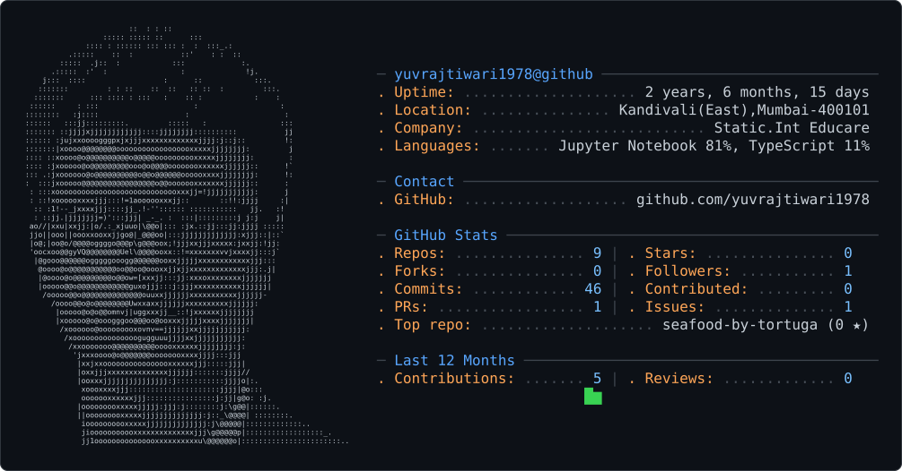

<picture>
  <source media="(prefers-color-scheme: dark)" srcset="dark_mode.svg" />
  <source media="(prefers-color-scheme: light)" srcset="light_mode.svg" />
  
</picture>

Hi there! 👋 I'm Yuvraj Yogendra Tiwari
🚀 Passionate coder and lifelong learner | Third-year Diploma in Computer Science at Thakur Polytechnic
🎓 Completed schooling from Children's Academy Group of Schools

💻 Creating innovative digital solutions with Java, Python, C/C++, and Web technologies
🎨 Exploring UI/UX design with Figma and frontend development

🛠️ Tech Stack & Skills
Programming Languages:

Java ☕
Python 🐍
C/C++ 💻
HTML5 & CSS3 🌐
Design & Development:

Figma 🎨 (UI/UX Design)
Web Development 🌍
Frontend Development
🌱 Currently Learning
Advanced web development concepts
Expanding my knowledge in software engineering principles
Exploring new technologies and frameworks
🎯 About Me
I'm a dedicated computer science student with a passion for technology and problem-solving. Currently pursuing my diploma at Thakur Polytechnic, I enjoy working on coding projects and learning new programming languages. I have a keen interest in both development and design, which led me to explore tools like Figma alongside my programming skills.

📫 Let's Connect!
Feel free to explore my repositories and don't hesitate to reach out if you'd like to collaborate on interesting projects or discuss technology!

email: yuvrajtiwari1978@gmail.com

Phone no.: +91-9321462802

linked in: (www.linkedin.com/in/yuvraj-yogendra-tiwari)

📍 Based in Mumbai, India

"Code is like humor. When you have to explain it, it's bad." - Cory House
